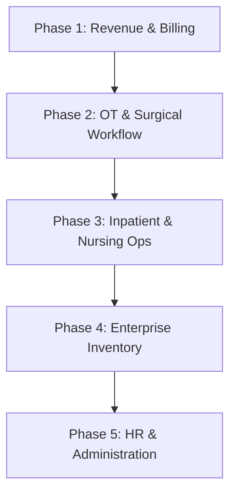

# 🏥 Hospyn 2.0: Full-Stack ERP Implementation Plan

This document outlines the strategic roadmap to transform Hospyn from a clinical AI companion into a complete, end-to-end Hospital Resource Planning (ERP) ecosystem. Each phase is **Full-Stack**, covering Database, Backend APIs, and Frontend UI.

---

## 🗺️ Roadmap Overview

---

## 💰 Phase 1: Revenue Engine (Billing & Finance)
*Target: Automate revenue collection and financial transparency.*

### 1. Database (SQLAlchemy Models)
- `Invoice`: Primary billing entity linked to Patient and Hospital.
- `BillItem`: Line items (Consultation, Pharmacy, Lab, Room Charges).
- `Payment`: Transaction logs (UPI, Cash, Card, Net Banking).
- `ChargeCategory`: Master list of prices for services.

### 2. Backend (FastAPI)
- **Auto-Billing Service**: Logic to automatically add charges when a doctor creates a prescription or lab order.
- **Payment Processing**: Integration hooks for gateways and manual cash entry.
- **Invoice Generator**: PDF generation for patient discharge and OPD visits.

### 3. Frontend (Hospital ERP - React)
- **Billing Dashboard**: Visualizing daily collections, pending dues, and refunds.
- **Cashier POS**: A rapid-entry interface for billing staff.

---

## 🔪 Phase 2: Surgical Excellence (OT Module)
*Target: Management of Operating Theaters and perioperative care.*

### 1. Database
- `OperationTheater`: Resource management (OT 1, OT 2, etc.).
- `SurgeryBooking`: Scheduling link between Surgeon, Patient, and OT.
- `PreOpChecklist`: Clinical safety validation before surgery.
- `SurgicalNote`: Detailed procedure logs and instrument tracking.

### 2. Backend
- **OT Scheduler**: Conflict-detection logic to prevent double-booking.
- **Clinical Event Stream**: Immutable logs for "Patient in OT", "Anesthesia Administered", "Recovery Transfer".

### 3. Frontend (Doctor Pro & Staff Portal)
- **OT Calendar**: Interactive booking view for surgeons.
- **Digital Surgical Record**: Touch-optimized interface for OT staff to log procedure details.

---

## 🏥 Phase 3: Ward Intelligence (IPD & Nursing)
*Target: Continuous care and bed management for admitted patients.*

### 1. Database
- `NursingNote`: Regular clinical observations by staff.
- `MedicationAdministrationRecord (MAR)`: Verification logs for medicine timings.
- `ShiftHandover`: Digital protocol for staff transitions.

### 2. Backend
- **Vitals Monitoring Service**: Analysis of nursing data to trigger "Early Warning Scores" (EWS).
- **MAR Validation**: Preventing medication errors through barcode/identity check.

### 3. Frontend (Staff Portal)
- **Nurse Station Dashboard**: "Live" view of ward occupancy and pending tasks.
- **IPD Timeline**: Longitudinal view of patient progress during admission.

---

## 📦 Phase 4: Enterprise Supply Chain (Inventory)
*Target: Tracking clinical and surgical consumables.*

### 1. Database
- `AssetInventory`: Beyond pharmacy—tracking syringes, gloves, kits, and oxygen.
- `StockIssue`: Movement from main store to sub-stores (Ward, OT).
- `ConsumptionLog`: Linking inventory used directly to the Patient's bill.

### 2. Backend
- **Supply Chain Logic**: Auto-deduction of stock when a procedure is performed.
- **Reorder Engine**: Predictive alerts when stock levels fall below safety margins.

### 3. Frontend (Hospital ERP)
- **Inventory Control**: Real-time stock counts and expiry tracking.
- **Vendor Management**: Purchase order generation and reconciliation.

---

## 👥 Phase 5: HR & Staff Administration
*Target: Hospital workforce and compliance management.*

### 1. Database
- `StaffRoster`: Duty schedules for Doctors, Nurses, and Support staff.
- `AttendanceLog`: Biometric-integrated attendance tracking.
- `PayrollRecord`: Salary processing based on duty hours and roles.

### 2. Backend
- **Roster Generator**: Intelligent scheduling to ensure department coverage.
- **Compliance Engine**: Automated generation of NABH/JCI required staff reports.

### 3. Frontend (Super Admin Dashboard)
- **HR Management**: Staff onboarding, documentation, and performance tracking.
- **Duty Roster View**: Global view of "Who is on duty where".

---

## 🛠️ Technical Implementation Strategy

For every phase, we follow the **"Vertical Slice"** approach:

1.  **Phase Initialization**: Create/Update `app/models/` for the specific module.
2.  **Logic Layer**: Implement business logic in `app/services/` (e.g., `BillingService`).
3.  **API Surface**: Expose secure endpoints in `app/api/v2/`.
4.  **UI Integration**: Build components in `hospital-erp` or `staff-portal`.
5.  **Audit & Security**: Ensure every action creates a forensic `AuditLog` entry.

> [!IMPORTANT]
> This plan assumes Insurance Verification is **not** required as per user instructions.
