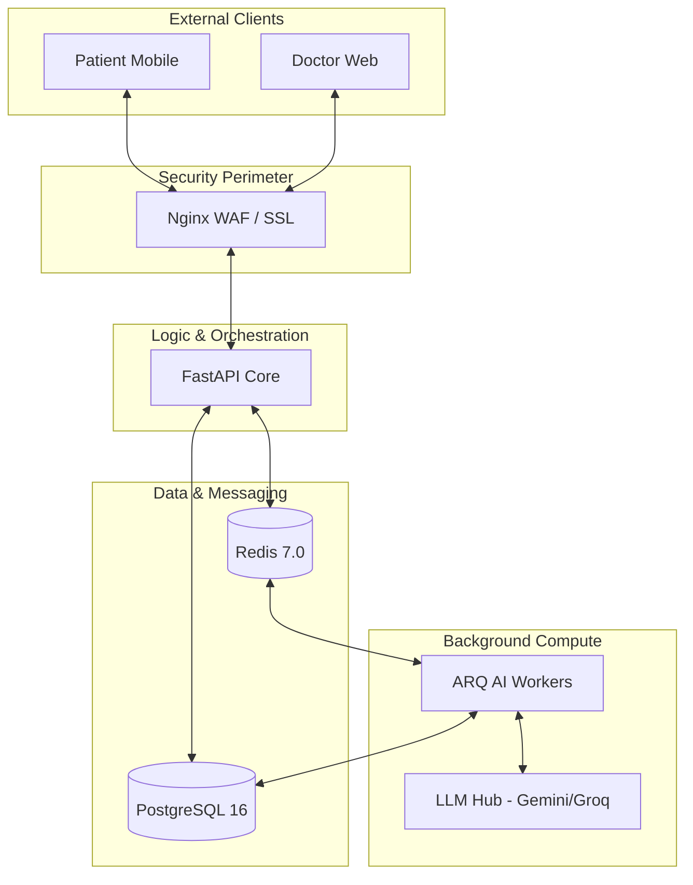

# Chapter 02: High-Level System Architecture

## 2.1 The Distributed Data Bus
AHP 2.0 is architected as a **Distributed Micro-Engine**. Unlike a standard monolith, every intensive compute task is offloaded to a non-blocking worker pool.

## 2.2 Core Components & Relationships
- **Frontend Layer:** React Native (Patient) & React (Doctor) communicate via REST and WebSockets.
- **API Gateway:** Nginx handles TLS termination and acts as a WAF.
- **Enterprise Logic Core:** FastAPI asynchronously orchestrates database and service calls.
- **State & Queue Layer:** Redis 7.0 manages real-time messaging, task queuing (ARQ), and session caching.
- **Persistence Layer:** PostgreSQL 16 stores structured clinical data.
- **AI Hub:** Independent service layer wrapping multiple LLM providers.
- **Compute Workers:** ARQ workers execute the AI processing pipeline in total isolation.

## 2.3 Visual Topology Diagram

## 2.4 Component Interaction Principles
- **Asynchronous Priority:** No request should wait for more than 500ms. Long-running AI tasks return a 202 Accepted status.
- **Statelessness:** The API can be horizontally scaled as all state resides in Redis/Postgres.
- **Isolation:** AI processing failures in Workers do not affect the main API availability.
