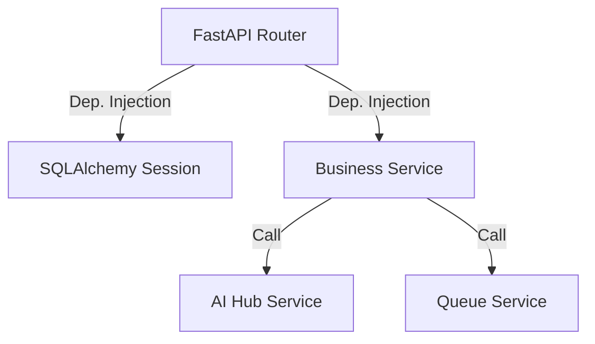

# Chapter 04: Backend Architecture

## 4.1 Backend Framework: Enterprise FastAPI
AHP 2.0 uses **FastAPI** for its asynchronous capabilities (uvicorn/gunicorn stack). The architecture is designed for **High-Throughput IO** where the database and AI network calls do not block the request-response cycle.

## 4.2 Service Structure (SOA Pattern)
The code is organized into a **Service-Oriented** structure to prevent a "Big Ball of Mud":
- **`app/api/v1`:** Handlers for HTTP routes. Contains no business logic.
- **`app/services`:** The core logic engine. Each file (e.g., `ai_service.py`) handles a single concern.
- **`app/repositories`:** Abstraction layer for database operations (SQLAlchemy).
- **`app/core`:** Cross-cutting concerns: Security, Config, Database initialization, and Real-time managers.

## 4.3 Request Handling & Middleware
Every request follows a strict pipeline:
1. **DDoS Protection Layer:** Middleware checks IP frequency.
2. **Forensic Audit Layer:** `audit_log_middleware` records the request method, path, and client IP.
3. **Identity Verification:** JWT dependency injection validates the token.
4. **Logic Execution:** Handled by the service layer.
5. **Response Formatting:** Pydantic models ensure standard JSON output.

## 4.4 Microservices vs. Monolith
AHP 2.0 is a **Modular Monolith**. It is distributed in execution (Workers vs. API) but shares a single codebase and database for maintainability. It can be easily split into microservices if needed by deploying the `workers/` and `api/` directories into separate pods.

## 4.5 Service Communication Flow

