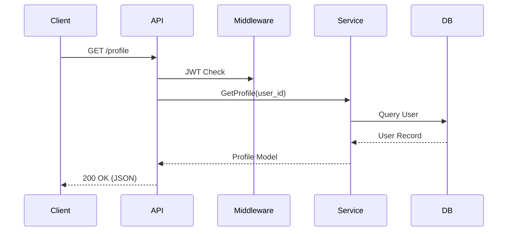
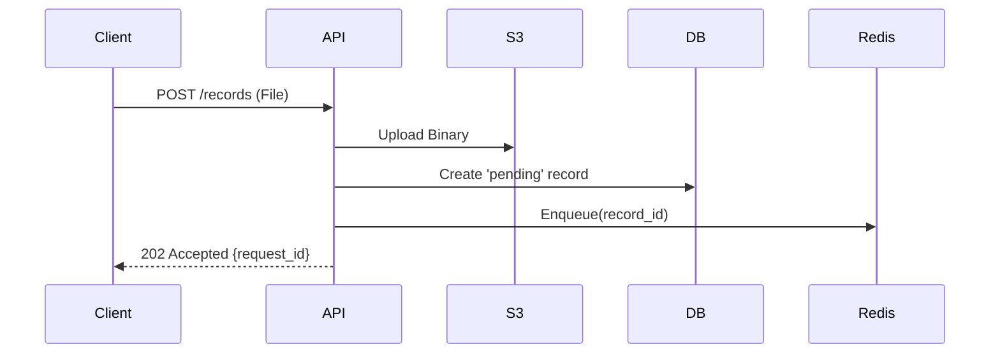

# Chapter 05: API Architecture

## 5.1 API Structure & Standards
Hospyn 2.0 follows a **RESTful REST-as-a-Platform** standard:
- **Versioning:** Path-based versioning (`/api/v1`).
- **Standardized Responses:** All error responses follow the RFC 7807 (Problem Details) format.
- **OpenAPI Doc:** Interactive documentation available at `/docs` (Swagger) and `/redoc`.

## 5.2 API Authentication Matrix
- **Header:** `Authorization: Bearer <JWT>` required for all `/api/v1/patient` and `/api/v1/doctor` routes.
- **Internal API Keys:** Used for communication between the App and specialized third-party integrations (e.g., Twilio, S3).

## 5.3 Rate Limiting Mechanism
Hospyn implements **Leaky Bucket** rate limiting via `SlowAPI`:
- **Unauthenticated:** 5 requests/minute for sensitive routes (Login/Register).
- **Authenticated:** 100 requests/minute for standard data retrieval.
- **Strategy:** Redis-backed storage to track usage across multiple API instances.

## 5.4 Request & Data Validation
Using **Pydantic V2**:
- **Strict Parsing:** Input is discarded if it doesn't match the schema exactly.
- **Data Coercion:** Handled gracefully for types like DateTime and Decimals.

## 5.5 API Workflow Diagrams (Visual)
### 5.5.1 Synchronous Data Retrieval

### 5.5.2 Asynchronous Document Submission

