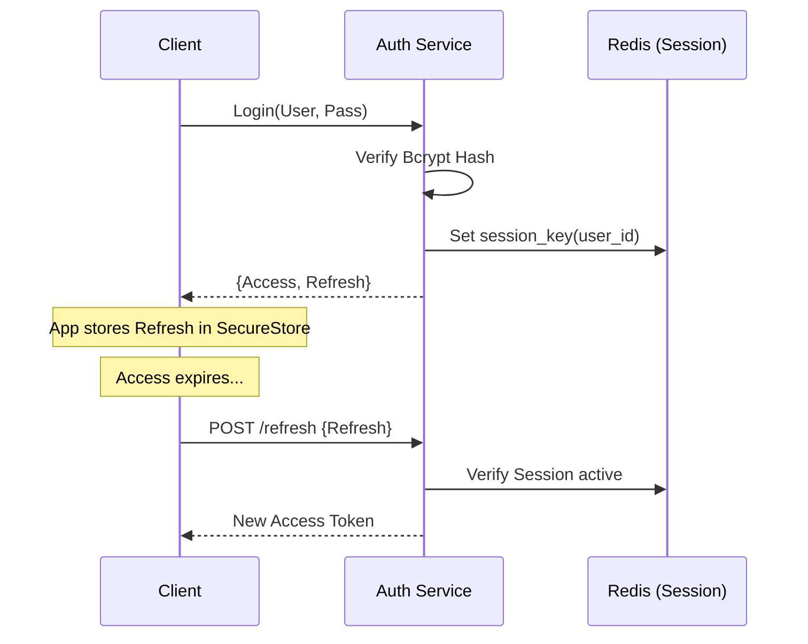

# Chapter 06: Authentication and Authorization

## 6.1 Identity Mesh Architecture
Identity in Hospyn 2.0 is not just a login; it is a **Scoped Boundary**. The system uses a **Double-Token JWT Lifecycle** to balance security and performance.

## 6.2 The Login Mechanism
1. **Frontend:** Secure password capture.
2. **Backend:** 
   - SHA256 pre-hashing (mitigates 72-byte limit of Bcrypt).
   - BCrypt hashing with a unique salt per user.
   - Generation of JTI (JWT ID) to enable server-side token revocation if necessary.

## 6.3 Token Payload & lifecycle
```json
{
  "sub": "user_id_123",
  "role": "patient",
  "exp": 123456789,
  "type": "access",
  "jti": "random_uuid"
}
```
- **Access Token:** 15-minute expiry (High security).
- **Refresh Token:** 7-day expiry (Stored in secure native storage).

## 6.4 Role-Based Access Control (RBAC)
Hospyn 2.0 uses a **Decorator-led Authorization** model. 
```python
@app.get("/records")
@require_role("patient")
async def get_patient_records(current_user: dict = Depends(get_current_user)):
    ...
```
- **Scoped Scrutiny:** Every service call verifies that the `id` being requested matches the `sub` in the token, or that the requester has overriding `admin` or `doctor-read` permissions.

## 6.5 Multi-Factor Authentication (MFA) Design
The system is built for **MFA-at-Scale**:
- **Twilio Integration:** Ready-to-use hooks for SMS OTP.
- **Totp Hooks:** Support for Authenticator apps (Google/Microsoft Authenticator) via the `pyotp` library.

## 6.6 Session Management Flow

