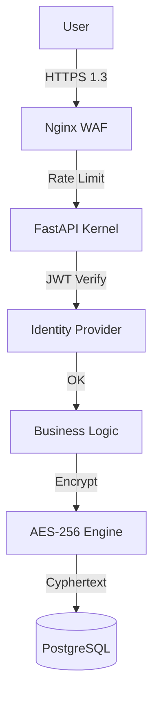

# Chapter 07: Security Layers

## 7.1 Defense-in-Depth Strategy
AHP 2.0 treats security as a **Primary First-Class Citizen**. The platform is built using a non-trust model where every layer must independently verify the integrity of the data.

## 7.2 Shield 1: Network & Perimeter
- **Cloud WAF/Nginx:** Filters SQL injection patterns and cross-site scripting (XSS) at the ingress point.
- **TLS 1.3:** Mandatory encryption for all traffic. Self-signed certificates are rejected in production.

## 7.3 Shield 2: Application Security
- **Strict Validation:** Pydantic models reject any request with unknown fields or invalid types.
- **CSRF & CORS:** Strict white-listing of origins (`ALLOWED_ORIGINS` in `config.py`).
- **File Upload Protection:** 
  - Verification of "Magic Bytes" (MIME type) instead of just file extensions.
  - Isolated storage in S3 with scan-on-write functionality.

## 7.4 Shield 3: Data Encryption (PII Hardening)
This is the **Core Privacy Shield**.
- **Field-level Encryption:** Sensitive fields (SSN, Phone, DOB) are encrypted using **AES-256 (Fernet)** before hitting the database.
- **Key Rotation:** Managed through the `app/core/encryption.py` module, supporting master key versioning.

## 7.5 Shield 4: Server & Infrastructure
- **Docker Isolation:** Services run as non-root users within unprivileged containers.
- **Secret Management:** Sensitive keys are injected via secure environment variables, never committed to VCS.

## 7.6 Monitoring and Attack Detection
- **Audit Logs:** Permanent, immutable recording of PHI access in the `audit_logs` table.
- **Fail-Fast Logic:** Repeated unauthorized attempts trigger automatic IP-based blocking in Redis.

## 7.7 Security Layer Schematic

