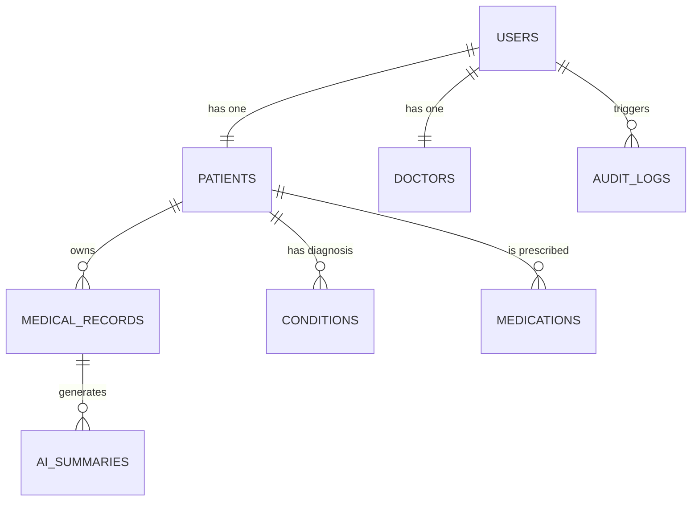
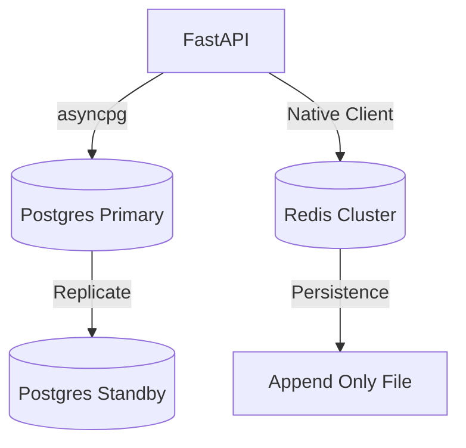

# Chapter 08: Database Architecture

## 8.1 The Multi-Datastore Mesh
AHP 2.0 uses a **Polyglot Persistence Layer** to optimize for both consistency and speed:
- **PostgreSQL 16:** Relational source of truth for all structured data (Users, Records, Clinical insights).
- **Redis 7.0:** Real-time persistence for sessions, caching, and task queuing.

## 8.2 Schema Design & Entity Relationships (ERD)
The schema is designed for extreme referential integrity and auditability.

## 8.3 Data Relationships & Normalization
- **Profile Decoupling:** User identity is separate from clinical profiles (Patient/Doctor), allowing for clean RBAC.
- **Record Versioning:** Medical records are immutable. Updates create new summary records, maintaining a historical audit trail.

## 8.4 Indexing & Query Strategy
- **Primary Indexes:** On `id` (UUID/Int) and unique clinical identifiers like `ahp_id`.
- **Compound Indexes:** On `(patient_id, created_at)` for high-speed dashboard aggregation.
- **Migration Strategy:** Managed via **Alembic**, ensuring zero-downtime schema upgrades.

## 8.5 Backup & Replication
- **WAL Archiving:** Continuous archiving of Write-Ahead Logs for point-in-time recovery (PITR).
- **Streaming Replication:** Hot-standby replica for immediate failover in case of primary database failure.

## 8.6 Database Workflow (Visual)

