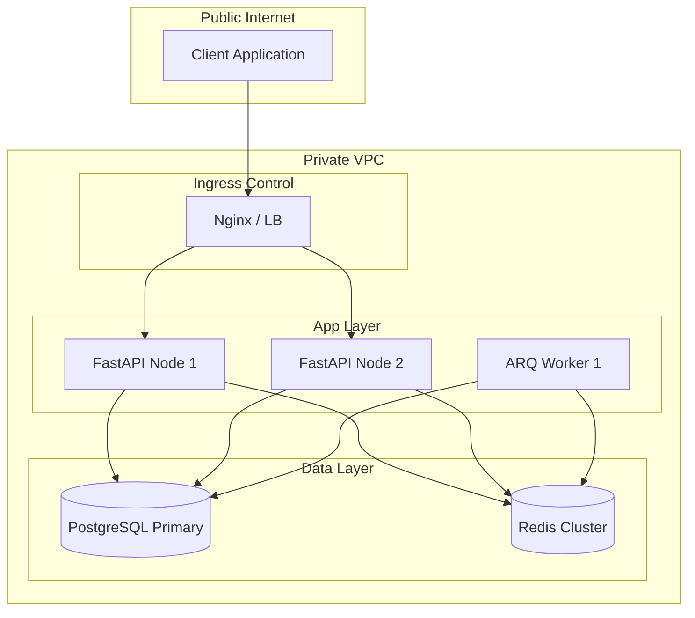

# Chapter 09: Infrastructure Architecture

## 9.1 Containerization & Topology
AHP 2.0 is a **Cloud-Agnostic Containerized Ecosystem**. It is built to run identically in Development, Staging, and Production.

## 9.2 Core Infrastructure Stack
- **Ingress Layer:** Nginx acting as a reverse proxy, SSL terminator, and load balancer.
- **Application Pool:** Multi-container FastAPI workers managed by Gunicorn for process management.
- **Task Pool:** Distributed ARQ workers connected to the shared Redis bus.
- **Caching & State:** Global Redis instance with high-availability sentinel.

## 9.3 Load Balancing & Auto-scaling
- **Horizontal Scaling:** API containers are balanced via Nginx Round-Robin.
- **Auto-scaling:** In Kubernetes environments, the `HorizontalPodAutoscaler` is configured to scale based on CPU usage and Redis queue depth.

## 9.4 Self-Healing Hierarchy
1. **Docker Level:** Restart policies (`unless-stopped`) ensure single-process recovery.
2. **Orchestration Level:** Kubernetes/Docker Swarm health checks (`livenessProbe`) restart stagnant containers.
3. **Application Level:** `recovery_controller.py` monitors system-wide health and can trigger database reconnection logic or cache flushes.

## 9.5 Infrastructure Topology Diagram

