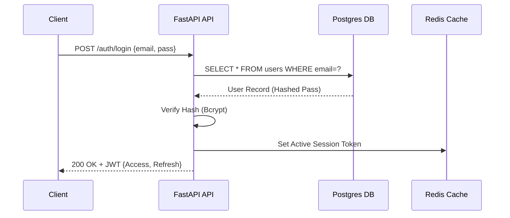
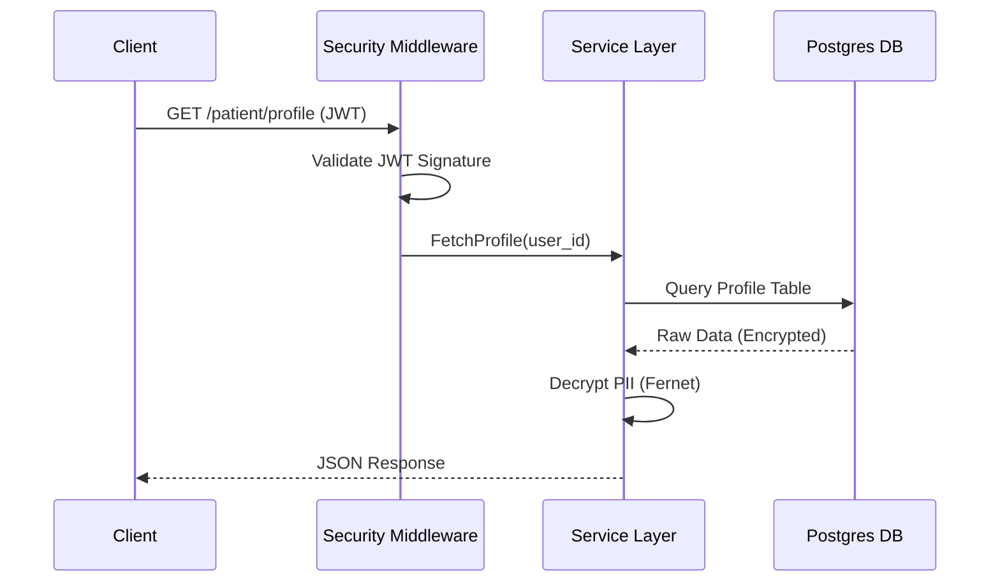
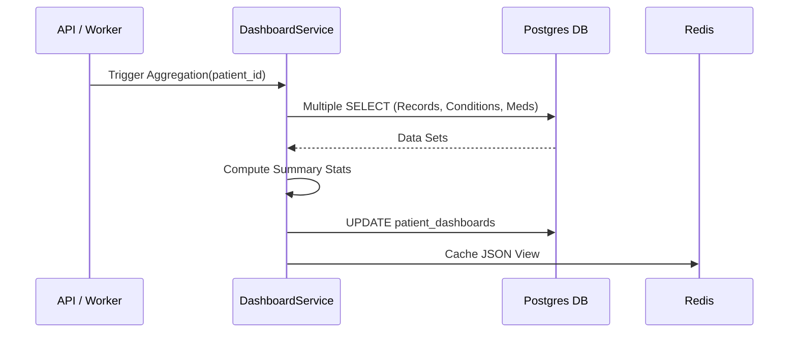
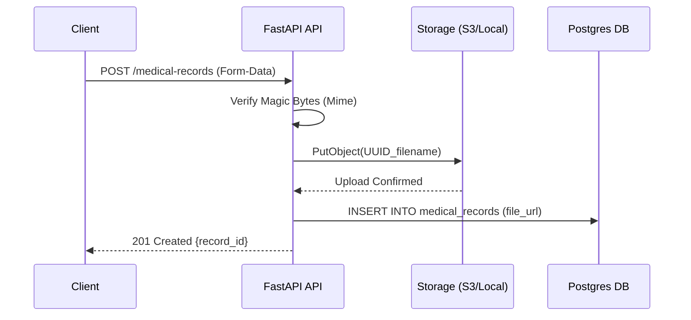
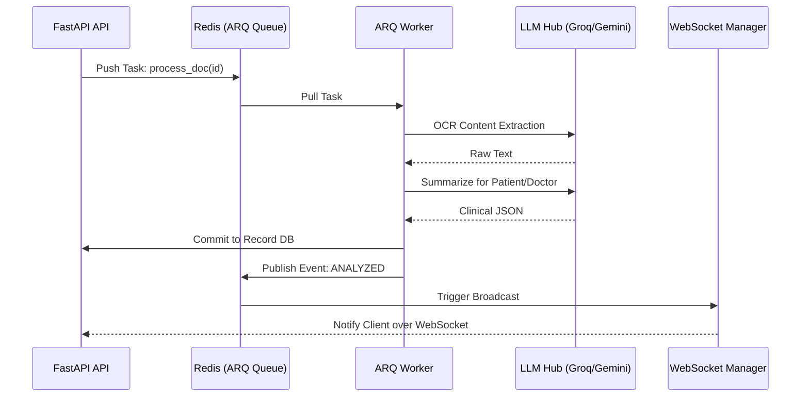

# Chapter 10: System Workflow

## 10.1 Mission-Critical Operation Sequences
Hospyn 2.0 is defined by how its components interact under pressure. This chapter breaks down the five core workflows.

## 10.2 Workflow: User Login
This secure handshake ensures identity and scope.

## 10.3 Workflow: Protected API Request Flow
How every data retrieval is guarded.

## 10.4 Workflow: Data Processing & Aggregation
How the dashboard stays accurate.

## 10.5 Workflow: Secure File Upload

## 10.6 Workflow: AI Neural Processing Pipeline
The most complex flow in the platform.

