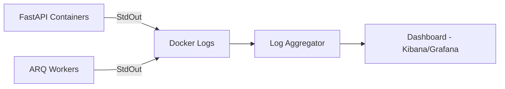

# Chapter 11: Monitoring and Logging

## 11.1 Forensic Visibility
Monitoring in AHP 2.0 is focused on **Forensic Accountability**. Every action involving medical data must be traceable to a specific actor and point in time.

## 11.2 Systematic Logging (Structured)
- **JSON Format:** Logs are emitted as single-line JSON objects to be easily consumed by aggregators (ELK/Graylog).
- **Correlation IDs:** Every request is assigned a `trace_id` that is passed from the API to the Workers and AI Hub, allowing for end-to-end debugging.

## 11.3 Logging Levels & Triggers
- **INFO:** Standard inbound requests and successful workflow steps.
- **WARNING:** LLM fallbacks (e.g., Groq rate limited, falling back to Gemini).
- **ERROR:** Database connection issues or critical worker crashes.
- **CRITICAL:** Security breaches or unauthorized PHI access attempts.

## 11.4 Error Tracking & Reporting
- **Sentry Integration:** Automatic capture of stack traces for unhandled exceptions (configured in `main.py`).
- **Slack/Email Alerts:** Automated notifications for system-wide performance degradation.

## 11.5 Performance & Health Monitoring
- **Readiness Probes:** `/ready` checks the operational health of Postgres, Redis, and AI connectivity.
- **Liveness Probes:** `/health` confirms the FastAPI process is alive.
- **Queue Depth:** Monitoring the number of pending tasks in Redis to detect architectural bottlenecks.

## 11.6 Logging Topology Diagram

