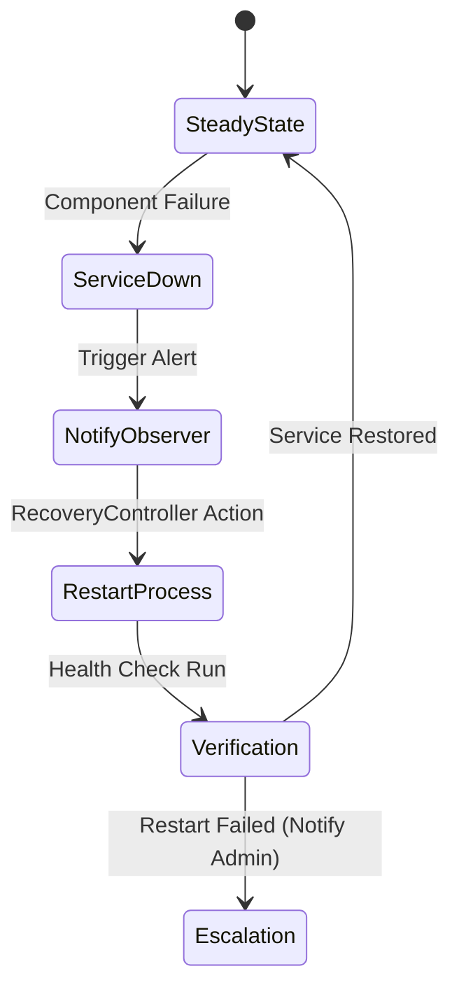

# Chapter 12: Disaster Recovery and Self-Healing

## 12.1 Resilience Philosophy
Hospyn 2.0 assumes that **Infrastructure Will Fail**. The platform is designed to detect and repair itself without human intervention.

## 12.2 Automated System Repair (Self-Healing)
The `recovery_controller.py` acts as a watchdog:
- **Container Health:** If a container stops responding to health checks, it is forcibly terminated and re-spawned.
- **Service Dependency:** If the Database is unreachable, the API enters a "Sleep & Retry" state until connectivity is restored, preventing application crashes.

## 12.3 Database Failover Strategy
- **Primary Failure:** The Nginx Proxy or Kubernetes Service Mesh automatically redirects traffic to the **Standby Read-Only Replica** while the primary is being restored.
- **Data Recovery:** Transaction logs (WAL) are shipped off-site for restoration in case of catastrophic storage failure.

## 12.4 Server Crash Recovery
1. **Detection:** Liveness probe fails.
2. **Action:** Orchestrator (Docker Compose/K8s) kills the process.
3. **Restoration:** Environment is re-initialized; Database migrations are re-synced if necessary.

## 12.5 Chaos Protection (The Chaos Monkey)
Hospyn includes a specialized `chaos_monkey.py` script:
- **Function:** Intentionally kills processes and severs network lines in a controlled staging environment.
- **Goal:** To prove that the "Self-Healing" logic actually works under real stress.

## 12.6 Recovery Sequence Diagram

# Chapter 12: Disaster Recovery and Self-Healing

## 12.1 Resilience Philosophy
Hospyn 2.0 assumes that **Infrastructure Will Fail**. The platform is designed to detect and repair itself without human intervention.

## 12.2 Automated System Repair (Self-Healing)
The `recovery_controller.py` acts as a watchdog:
- **Container Health:** If a container stops responding to health checks, it is forcibly terminated and re-spawned.
- **Service Dependency:** If the Database is unreachable, the API enters a "Sleep & Retry" state until connectivity is restored, preventing application crashes.

## 12.3 Database Failover Strategy
- **Primary Failure:** The Nginx Proxy or Kubernetes Service Mesh automatically redirects traffic to the **Standby Read-Only Replica** while the primary is being restored.
- **Data Recovery:** Transaction logs (WAL) are shipped off-site for restoration in case of catastrophic storage failure.

## 12.4 Server Crash Recovery
1. **Detection:** Liveness probe fails.
2. **Action:** Orchestrator (Docker Compose/K8s) kills the process.
3. **Restoration:** Environment is re-initialized; Database migrations are re-synced if necessary.

## 12.5 Chaos Protection (The Chaos Monkey)
Hospyn includes a specialized `chaos_monkey.py` script:
- **Function:** Intentionally kills processes and severs network lines in a controlled staging environment.
- **Goal:** To prove that the "Self-Healing" logic actually works under real stress.

## 12.6 Recovery Sequence Diagram

