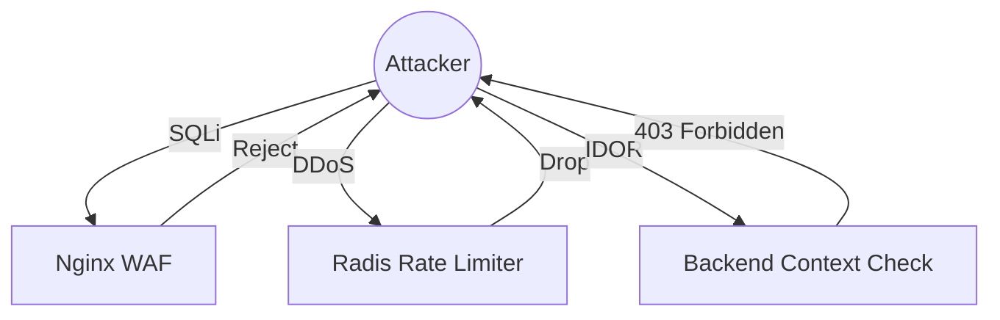

# Chapter 13: Security Threat Model

## 13.1 Systematic Threat Analysis
Hospyn 2.0 uses a proactive threat model based on the STRIDE methodology. We assume attackers are constantly auditing our endpoints.

## 13.2 Attack Vector 1: Injection Attacks
- **Description:** Attempting to inject SQL or Script through form inputs.
- **Defense:** Mandatory Pydantic sanitization and SQLAlchemy parameterized queries.
- **Extreme Check:** Weekly automated `injection_test.py` scans every endpoint with 500+ payload variants.

## 13.3 Attack Vector 2: Unauthorized Access (IDOR)
- **Description:** Using a valid token to access another patient's data by changing a URL parameter.
- **Defense:** Sub-level validation. The system verifies that the `id` in the database record belongs to the `sub` in the requester's JWT.

## 13.4 Attack Vector 3: Brute Force & Credential Stuffing
- **Description:** Automated password guessing.
- **Defense:** Leaky bucket rate limiting on `/login` and `/register`. Temporary account lockdown after 5 failed attempts in 1 hour.

## 13.5 Attack Vector 4: Distributed Denial of Service (DDoS)
- **Description:** Overwhelming the API with a flood of junk traffic.
- **Defense:** Ingress filtering at the Nginx layer. Traffic exceeding 100 requests per second from a single IP is automatically dropped.

## 13.6 Attack Vector 5: AI Privacy Leakage
- **Description:** Attempting to query the AI in a way that leaks other patients' clinical data.
- **Defense:** Isolated Contexts. Every AI prompt is injected with a strict "Patient Context" that limits the AI's visibility to only the current record.

## 13.7 Threat Matrix Visualization

