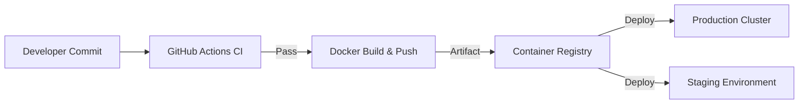

# Chapter 14: DevOps and Deployment

## 14.1 Continuous Hardening Pipeline
Deployment in AHP 2.0 is fully automated. No developer has direct SSH access to the production database; all changes are applied via CI/CD.

## 14.2 The CI/CD Pipeline (GitHub Actions)
Every Pull Request triggers a series of security and quality gates:
1. **Linting & Style:** `ruff` enforces standard Python ergonomics.
2. **Type Checking:** `mypy` ensures strict type safety across the async codebase.
3. **Security Scan:** `bandit` audits the code for common vulnerabilities (e.g., hardcoded keys).
4. **Unit & Integration Tests:** `pytest` runs the full test suite against a ephemeral Postgres container.

## 14.3 Environment Management
AHP 2.0 maintains absolute consistency using Docker:
- **Development:** Locally hosted containers via `docker-compose`.
- **Staging:** A "Mirror" of production for chaos testing and final QA.
- **Production:** High-availability cluster with blue-green deployment windows.

## 14.4 Staging vs. Production Logic
- **Staging:** Debugging enabled; `chaos_monkey.py` active.
- **Production:** Debugging disabled; Forensic logging active; Encryption keys stored in Cloud HSM (Hardware Security Module).

## 14.5 Deployment Workflow Diagram

