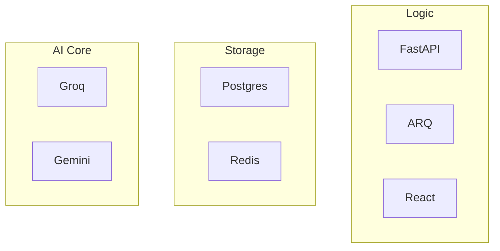

# Chapter 15: Technology Stack

## 15.1 The Enterprise Stack Rationale
AHP 2.0 is built using industry-leading technologies chosen for their performance, security, and developer ergonomics.

## 15.2 Core Stack
- **Backend:** FastAPI (Python). Chosen for high execution speed, native `asyncio` support, and automatic OpenAPI documentation.
- **Frontend (Mobile):** Expo / React Native. Chosen for cross-platform efficiency and access to native hardware.
- **Frontend (Web):** React / Vite. Chosen for low local-dev latency and high-speed build artifacts.
- **Worker Engine:** ARQ (Redis-backed). Chosen for native async execution without the thread-blocking issues of Celery.

## 15.3 Database & Intelligence
- **Persistence:** PostgreSQL 16. The industry standard for relational safety and encrypted data types.
- **Cache/Messaging:** Redis 7.0. Chosen for low-latency session and task management.
- **AI Hub:** Multi-LLM (Groq, Gemini, Anthropic). A hybrid approach minimizes cost while maximizing accuracy and speed.

## 15.4 Security & Monitoring tools
- **Encryption:** AES-256 (Cryptography/Fernet).
- **Static Analysis:** Ruff, Mypy, Bandit.
- **Telemetry:** Sentry, Python Logging, Prometheus/Grafana ready.

## 15.5 Visual Stack Matrix

