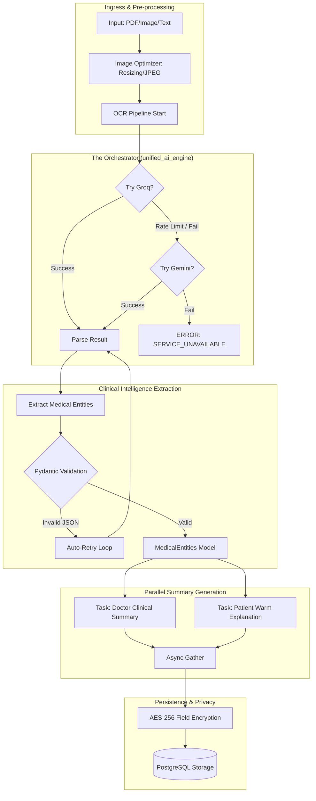
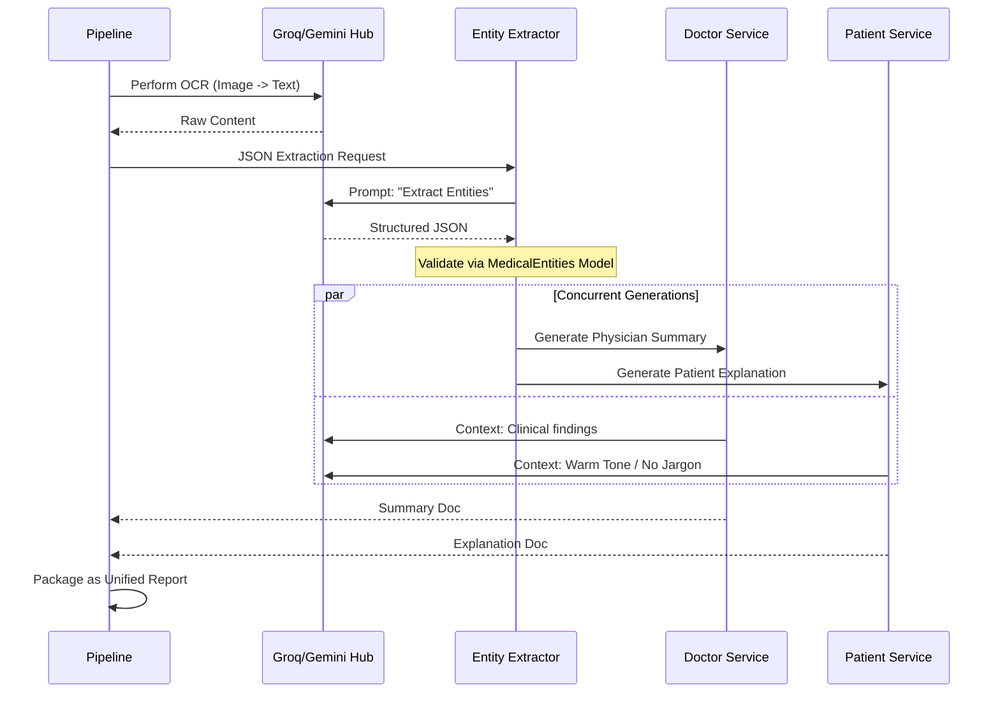

# AI Engine Architecture: The "Neural Pipeline"

## 1. Unified Intelligence Orchestrator
The AHP 2.0 Engine is an **Asynchronous Priority-Based Hub**. It doesn't rely on a single LLM; instead, it orchestrates multiple providers to ensure sub-10s latency even during provider outages.

### 1.1 The "Unified AI Engine" Logic Flow

## 2. Technical Component Breakdown
| Layer | Technology | Function |
| :--- | :--- | :--- |
| **Orchestration** | `AsyncAIService` | Manages state, httpx clients, and fallback logic. |
| **Speed Layer** | Groq (Llama 3) | Optimized for raw text extraction and speed. |
| **Vision Layer** | Gemini 1.5 Flash | Reserved for complex OCR and vision tasks. |
| **Validation Layer** | Pydantic V2 | Ensures clinical data matches strict medical schemas. |
| **Privacy Layer** | Cryptography (Fernet) | Encrypts SSN, Conditions, and Medications at rest. |

## 3. Parallel Execution Sequence

