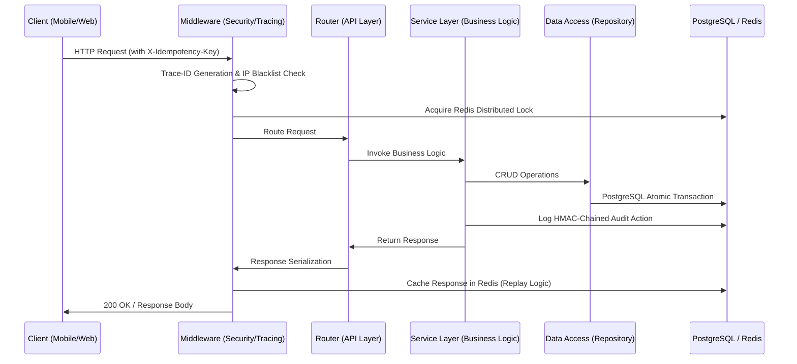
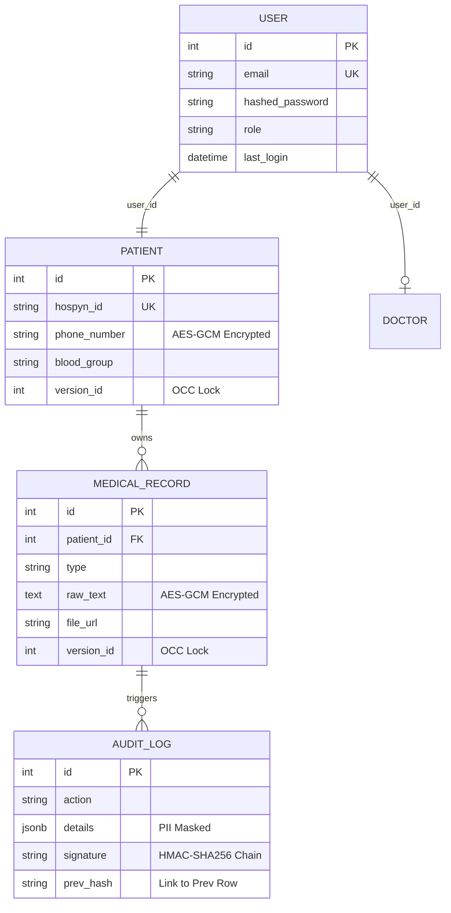

# Hospyn 2.0 Enterprise Technical Architecture

This document provides a deep-dive into the hardened backend and database architecture of the Hospyn 2.0 platform.

---

## 1. Backend Service Architecture
The backend is built on **FastAPI** using an asynchronous (non-blocking) I/O model. It follows a strict **Layered Architecture** to ensure separation of concerns and production scalability.

### Request Lifecycle Diagram

### Core Components
- **API Layer**: FastAPI routers enforcing Pydantic schemas for input validation.
- **Service Layer**: Handles multi-step operations (e.g., Clinical Analysis, Identity Management).
- **Security Middleware**: 
    - **Identity**: JWT with HS256 validation.
    - **Throttling**: Distributed sliding-window rate limiting.
    - **Containment**: Adaptive IP blacklisting.
- **Observability**: Prometheus SLI exporters (Latency, Error Rates, Throughput).

---

## 2. Database Architecture (SOT)
The system utilizes a single **PostgreSQL** instance as the Source of Truth, augmented by **Redis** for transient state and distributed synchronization.

### Entity Relationship & Security Schema

### Enterprise Integrity Features
1.  **Optimistic Concurrency Control (OCC)**:
    - Every critical table contains a `version_id`. 
    - Updates are enforced with: `WHERE id = :id AND version_id = :old_version`.
    - Prevents data corruption during simultaneous clinical edits.

2.  **Field-Level Encryption (At Rest)**:
    - Sensitive fields (Phone, Medical Text) use **AES-GCM Authenticated Encryption**.
    - Each field has a unique 12-byte IV (nonce).
    - Supports **Key Rotation** via a secondary key pool.

3.  **Cryptographic Audit Chaining**:
    - Every log entry is signed: `HMAC(Secret, Prev_Hash + Current_Data)`.
    - This creates an immutable ledger where row deletion or modification is mathematically detectable.

4.  **Distributed Idempotency**:
    - Redis-backed response replay for `/upload` and `/payment` endpoints.
    - Ensures that network retries do not create duplicate clinical records.
